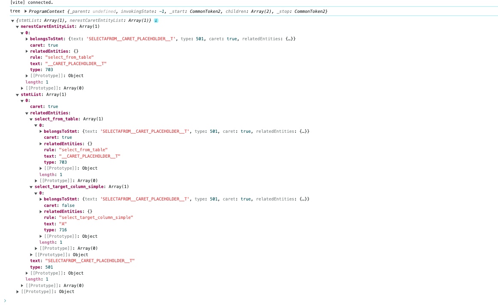
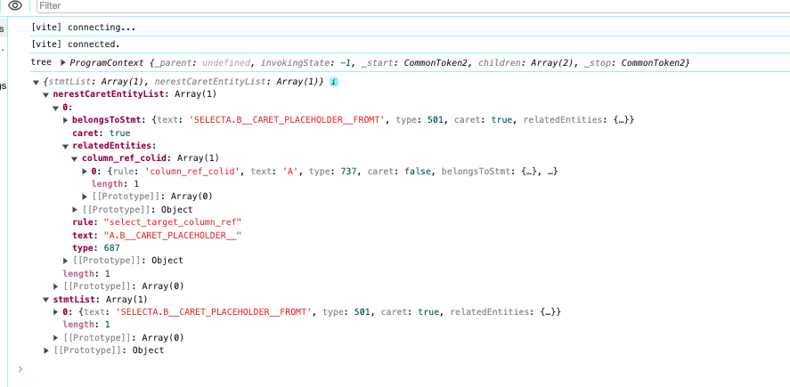

# dt-sql-parser-analyse-demo

本项目只是一个demo项目，用来交流和验证开发思路。

作为demo，难免会有很多不完善的地方，请多包涵。

> 启动环境： 建议node20以上，低版本不确定。

```
npm run dev
```

## 背景

许多用户在使用dt-sql-parser或monaco-sql-languages时，有基于上下文精准推荐用户补全内容的需求。具体可以参考下面这个讨论：

https://github.com/DTStack/dt-sql-parser/discussions/250

根据这个讨论中的开发思路和痛点，结合我这边之前基于monaco-sql-languages做的开发，我整理了一下之前的代码逻辑，便有了这个项目。

## 思路

本项目创建了一个DtSqlParserPostgresqlPlugin(下称plugin)。
> 因为我这边之前主要是基于Posrgresql做开发，所以命名中有Posrgresql，实际上这个plugin可以自定义使用任意语言的parser解析。

使用方式:

```typescript
const myPlugin = new DtSqlParserPostgresqlPlugin()
// 假设光标的位置为SELECT a| FROM t
const sql = 'SELECT a FROM t'
const result = myPlugin.parse(sql, { lineNumber: 1, columnNumber: 9 })
console.log(result)
```

此plugin主要对sql进行了以下处理：

- 插入光标
- 添加预处理器
- 基于语句，实体，规则链进行增强解析

### 插入光标

当plugin拿到sql后，第一步是基于配置中的`lineNumber`和`columnNumber`插入一个光标占位符

默认的占位符文本为`__CARET_PLACEHOLDER__`:

```typescript
export const DEFAULT_CARET_PLACEHOLDER = '__CARET_PLACEHOLDER__'
```

上面的示例中，插入光标占位符后sql文本变为:

```sql
SELECT a__CARET_PLACEHOLDER__ FROM t
```

### 预处理器

在sql的编辑中我们常遇到这样一种情况，以postgresql为例：

```sql
ALTER TABLE tabl|
```

当用户输入到这里的时候，目前dt-sql-parser中的postgresql antlr4语法会认为这是一个错误，因为postgresql官方的文档里要求`ALTER TABLE table`的后面至少要有一个action。但是这种场景又是用户输入时经常出现的，不能因为这里的语法错误就不给提示了。

因此我这边采用的方案是，当匹配到用户输入`ALTER TABLE tabl`这种结构时，通过自动在后面添加一些简单的语句来使得整体语句能正常解析，从而拿到对应结果。

```typescript
export const addSuffixForParseAlterTableProcessor: Preprocessor = (sql: string) => {
  const suffix = 'SET WITHOUT OIDS'
  const maxWords = 4
  if (/alter( )+table/.test(sql.toLowerCase()) && sql.split(' ').filter(item => item).length < maxWords) {
    return sql + '' + suffix
  }
  return sql
}
```
比如这里我就通过加上了一个`SET WITHOUT OIDS`，使得语法可以正确解析。这个语法不会添加额外的实体，从而也不会影响后续基于实体的分析。

如上所述，形如
```typescript
export type Preprocessor = (sql: string) => string
```
的函数被称为一个预处理器。我们可以在配置时添加自定义的预处理器。

```typescript
const myPlugin = new DtSqlParserPostgresqlPlugin({
  preprocessor: [
    ...defaultPreprocessorList, // 也可以不加，从零开始自定义预处理器
    myPreprocessor,
    (sql) => sql.toUpperCase() // 内联模式
  ]
})
```

### 增强解析

整个demo的核心是增强解析功能，它通过预设的语句，实体和规则链来实现自定义语义化的解析结果。

首先解释一下相关名词的含义。

#### 语句

一般来说一段可不依赖前后文独立理解其作用的sql内容被称为一条语句，按照dt-sql-parser中的定义，语句一般是指匹配规则后缀为`RULE_xxx...stmt`的内容。以postgresql举例，有`RULE_selectstmt`，`RULE_insertstmt`等。

#### 实体

按照[基于语法上下文补全](https://github.com/DTStack/dt-sql-parser/discussions/250) 中开发者的定义。实体是指：

> 所有可以用 DDL 语句创建的都需要被收集，比如表名、库名等，下文中统一称之为实体（Entity）

#### 规则链

规则链是我这边自定义的一种结构，也是整个解析逻辑的关键。规则链是一个`number[]`，其元素来自`dt-sql-parser`中定义的所有`ruleIndex`。这些`ruleIndex`可以从Parser的静态参数中获得，例如：
```typescript
[
  PostgreSQLParser.RULE_selectstmt,
  PostgreSQLParser.RULE_select_clause,
  PostgreSQLParser.RULE_target_list,
  PostgreSQLParser.RULE_column_name
]
```

一条规则链总是以语句/实体开头，以到达的实体结尾。

---

增强解析的实现逻辑是: **从一个语句/实体节点开始，找到所有匹配规则链的实体，将实体信息放入父语句/实体的`relatedEntities`对象下以规则链名称为key的实体列表里。**

匹配规则链的逻辑为：当实体节点所在的节点ruleIndex路径上存在此规则链中的所有ruleIndex，且顺序一致。则认为其匹配这个规则链。

例如，定义以下语句，实体和规则链：
```typescript
/**
 * 这里对语句和实体的类型定义实际上是dt-sql-parser里命名规则时的公共字符串。
 * 因为代码实现的时候方便直接将这些字符串映射到对应的ruleIndex和visitor
 * 比如: selectstmt -> RULE_selectstmt -> visitor.visitSelectstmt()
 */
export const stmts: string[] = [
  'selectstmt'
]

export const entities: string[] = [
  'column_name',
  'table_name',
]

export const rules: Record<string, number[]> = {
  select_target_column_simple: [
    PostgreSQLParser.RULE_selectstmt,
    PostgreSQLParser.RULE_select_clause,
    PostgreSQLParser.RULE_target_list,
    PostgreSQLParser.RULE_column_name
  ],
  select_from_table: [
    PostgreSQLParser.RULE_selectstmt,
    PostgreSQLParser.RULE_select_clause,
    PostgreSQLParser.RULE_from_clause,
    PostgreSQLParser.RULE_table_name
  ]
}
```
当调用plugin.parse进行解析时:

```typescript
const myPlugin = new DtSqlParserPostgresqlPlugin()
// 假设光标的位置为SELECT a| FROM t
const sql = 'SELECT a FROM t'
const result = myPlugin.parse(sql, { lineNumber: 1, columnNumber: 9 })
console.log(result)
```

就可以得到以下内容


从图中我们可以看到，解析结果将这条select语句放到了`stmtList`中，在这条语句的`relatedEntities`里，出现了以规则链名称命名的实体列表。从规则的名称中就可以看出里面的实体在这条语句中的语义。

在返回结果中还有一项`nearestCaretEntityList`，表示当前光标所在的实体。从这个实体的`belongsToStmt`我们可以方便地定位此实体所在的语句。

得到上图的结果后，假如我们要实现根据用户后面的table名称提示前面可用的columns，我们就可以这样：

```typescript
if (result.nerestCaretEntityList[0].type === PostgreSQLParser.RULE_column_name && result.nerestCaretEntityList[0].rule === 'select_column') {
  const columnPrefix = result.nerestCaretEntityList[0].text.replace(DEFAULT_CARET_PLACEHOLDER, '')
  const tableName = result.nerestCaretEntityList[0].belongsToStmt.relatedEntities.select_from_table[0].text
  console.log(`will fetch column start with ${columnPrefix} from table ${tableName}`)
// }
```

常见的另一种情况是，对于一个实体，使用者还期望获取它的一些详细信息。

因此，一条规则链也可以以实体开头，以更深层的实体结尾。会把匹配到的实体按照相同规则放到父实体的`relatedEntities`下。

例如，在之前的基础上，添加以下实体和规则链：
```typescript
entities.push(...['column_ref', 'colid'])
rules = {
  ...rules,
  select_target_column_ref: [
    PostgreSQLParser.RULE_selectstmt,
    PostgreSQLParser.RULE_select_clause,
    PostgreSQLParser.RULE_target_list,
    PostgreSQLParser.RULE_columnref
  ],
  column_ref_colid: [
    PostgreSQLParser.RULE_columnref,
    PostgreSQLParser.RULE_colid
  ]
}
```

解析以下语句:

```typescript
// 假设光标的位置为SELECT a.b| FROM t
const sql = 'SELECT a.b FROM t'
const result = myPlugin.parse(sql, { lineNumber: 1, columnNumber: 11 })
console.log(result)
```

便可得到以下内容：


我们可以看到，在光标所在的column实体的`relatedEntities`中，出现了`column_ref_colid`的属性以及其对应实体列表。这样，我们就可以拿这个colid实体进一步精细化推荐，例如将colid作为schemaName，只推荐这个schema下的column

实际上，在具体使用时，语句和实体的类型经常会被使用者扩展。比如，如果使用者期望收集所有的columns别名，在后续再输入columns时可以提示这些别名，这时column alias(在postgresql语法中似乎是RULE_collabel，不确定)就会成为使用者期望收集的一种实体。

因此，我在plugin的配置项中添加了自定义语句，实体，和规则链。

```typescript
const myPlugin = new DtSqlParserPostgresqlPlugin({
  parse: {
    parser: new PostgresSQL(), // 这里便可自定义使用的语言
    stmts: myStmts,
    entities: myEntities,
    rules: myRules
  }
})
```

> 语句和实体在这里被设置成了必须注册才能使用。虽然说理论上可以以任何一个ruleIndex作为语句和实体，但是我认为如果不加以显式声明，会导致结果变得混乱，出现各种循环引用，失去了结果的简洁性，也不好维护了。

## 可以解决的问题

- sql结合光标的问题

- 收集sql 上下文中出现的表名，字段名，函数名等

- 在语句报错时仍然正确解析
  > 可以通过自定义预处理器完成

- 别名问题
  > 将alias作为一个实体的子实体收集即可，默认规则里添加了column的alias规则

- 无法区分不同的含义但是相同类型的实体，比如select的字段和where子句中出现的字段
  > 定义两个不同的规则链即可，比如select_target_column和select_where_column


## End